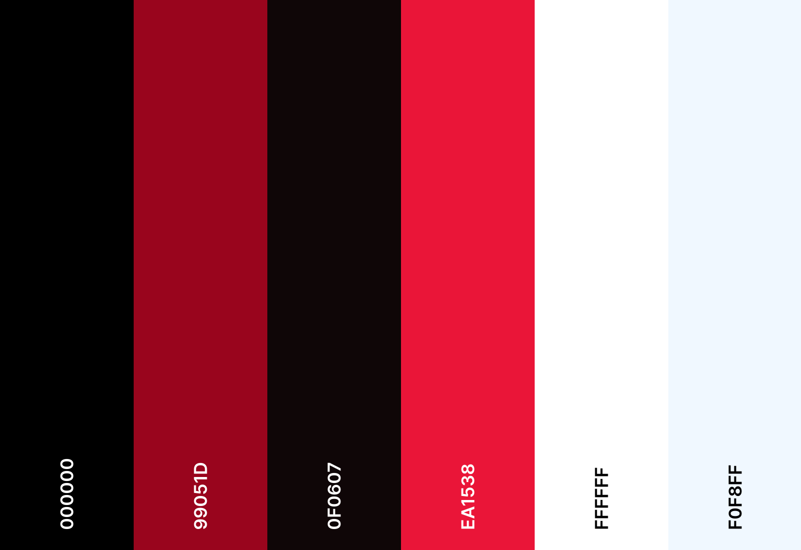
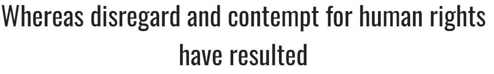

# SAVIN DESIGN
(Developer: Sanor Smith)

[SAVIN DESIGN Live Page]( https://sanorsmith.github.io/CI_PP1_SD/)

## Table of Content
#
0. [Introduction](#introduction)
1. [Project Goals](#project-goals)
    - [User Goals](#user-goals)
    - [Company Objectives](#company-bjectives)
2. [User Experience(UX)](#user-experienceux)
    - [Intended audience](#ideal-user)
    - [User Requirements and Expectations](#user-requirements-and-expectations)
    - [User Stories](#user-stories)
3. [Design](#design)
    - [ Chosen Design](#chosen-design)
    - [Wireframes](#wireframes)
    - [Colour](#colour)
    - [Fonts](#fonts)
    - [Structure](#structure)
    
4. [Technologies Used](#technologies-used)
    - [Primary Programming Languages Employed](#languages)
    - [Frameworks & Tools](#frameworks-libraries--programs-used)
5. [Features](#features)
     - [Existing-features](#existing-features) 
6. [Testing](#validation)
    - [HTML Validation](#html-validation)
    - [CSS Validation](#css-validation)
    - [Accessibility](#accessibility)
    - [Performance](#performance)
    - [Device testing](#device-testing)
    - [Browser compatibility](#browser-compatability)
    - [Testing user stories](#testing-user-stories)
8. [Bugs](#bugs)
9. [Deployment](#deployment)
   - [Deploying on GitHub pages](#deploying-on-github-pages)
   - [Local Development](#local-development)      
10. [Credits](#credits)
11. [Acknowledgments](#acknowledgments)

## Introduction

SAVIN will be announced in 2024 by Sanor Smith and Sharmen Bilbas, the company will stand out in the field of architecture for its innovative and sustainable designs. The company believes architecture is an art that shapes human experiences, blending beauty with practicality. Its team of skilled architects and designers handles a diverse range of projects, emphasizing ecological responsibility and energy efficiency. SAVIN is recognized for its impressive portfolio and is committed to pushing architectural boundaries with advanced technology and innovative practices, aiming to meet the evolving needs of society.

## Project Goals 
***

### User Goals
- To find an architectural company that provides efficient, safe, and high-quality services.
- Seek a comprehensive overview of the company's offerings.
- Transparent and clear pricing for all services.
- Easily accessible information about the company.
- Clearly displayed location of the architectural firm.
- Conveniently available contact information for the business.
- Multiple options for communication and connection with the company.

### Company Objectives

- Market and promote the architectural services effectively.
- Attract and increase the clientele base with innovative strategies.
- Grow and develop the architectural business.
- Deliver exceptional services tailored to diverse client needs.
- Offer accessible and prompt information about the firm to prospective clients.
- Establish a unique identity and stand out from other architectural competitors.
- Add significant value to clients and the architectural industry.

[Back to top &uarr;](#SAVIN DESIGN)

User Experience (UX)
### Intended audience

- New clients interested in architectural services.
- Experienced individuals or entities in need of advanced architectural expertise.
- Repeat clients who appreciate the value and service provided by the architectural firm.

### User Requirements and Expectations

- Concise and well-organized content tailored for architectural interests.
- User-friendly and straightforward navigation system.
- Fully functional website with all features operating seamlessly.
- Aesthetically pleasing design that showcases architectural elegance.
- Website accessibility on various devices and screen sizes.
- Straightforward and effortless methods for contacting the architectural firm.

### User Stories

####  New(First-time) User

New(First-time) User
- As a new user, I want to easily navigate the website.
- As a new user, I want to understand the company's offerings.
- As a new user, I want to know the pricing of the company's services.
- As a new user, I want to discover the most efficient way to contact the company.
- As a new user, I want to find information about the company's location.
- As a new user, I want to learn about the company's history and how long it has been in existence.
- As a new user, I want to get a sense of what it's like to use one or more of the services.
- As a new user, I want to see the design of completed projects.

#### Returning User
- As a returning client, I need to easily find information on the architectural firm's website as per my previous experience.
- As a returning client, I desire easy and quick access to contact the company or to navigate back to the homepage.
- As a returning client, I aim to find and connect with the architectural company on social media platforms.
- As a returning client, I am interested in learning more about the architectural team and their qualifications.
- As a returning client, I wish to explore all available service options offered by the architectural firm.
- As a returning client, I desire a seamless website experience that I can confidently recommend to my associates.

[Back to top &uarr;](#SAVIN DESIGN)

## Design

### Design decisions
This project has been crafted to appeal to a diverse range of clients and potential users, featuring a minimalist white background complemented by striking, high-quality images of architectural designs and structures. This visually engaging and attractive approach aims to capture attention and interest.

### Wireframes

***

- [Mobile-wireframes(pdf)](docs/wireframes/Mobile_Wireframes.pdf)
- [Tablet-wireframes(pdf)](docs/wireframes/Tablet_Wireframes.pdf)
- [Desktop-wireframes(pdf)](docs/wireframes/Desktop_Wireframes.pdf)

### Colour
A minimalist colour palette that gives the website a bright and uncluttered appearance.

### Fonts

Google fonts are used as follows:

- The website primarily employs the Oswald sans-serif font, which is integrated into the CSS file using the @import method. However, to enhance site performance, we opt to download it and link it through @font-face class. This font was selected for its compatibility with web body text, ensuring readability even at small sizes.

- The contact form utilizes the Font Awesome 6, which has been imported into the html through java-script. This font family was chosen for its excellent readability.

### Structure

The website is designed to be intuitive, user-friendly, and familiar, structured as a single landing page segmented into distinct sections. Navigation is tailored separately for mobile and desktop screens, following standard industry practices. The website is divided into six separate sections as follows:

- Main Section: This is the idol section with an engaging image, dual navigation tailored to screen size, a welcoming introduction, and a brief overview of the architectural firm.

- Projects Section: Showcasing three different types of architectural services or projects for clients to explore.

- Portfolio Section: A carousel feature displaying a selection of the firm's past architectural projects.

- Gallery Section: Images that highlight the firm's architectural achievements and project snapshots.

- About Us Section: Detailed information about the architectural company, its history, and philosophy.

- Contact Us Section: Essential contact information, an inquiry form, and an integrated Google Maps feature pinpointing the firm’s location.

## Technologies Used

### Languages
- HTML5
- CSS

### Frameworks Libraries & Programs Used
- GitHub
- Git
-Visual Studio Code
- Squoosh
- Photoshope
- Font Awesome
- Google Fonts
- Balsamiq
- Coolors
- Archicad
- Grammarly

[Back to top &uarr;](#SAVIN DESIGN)
