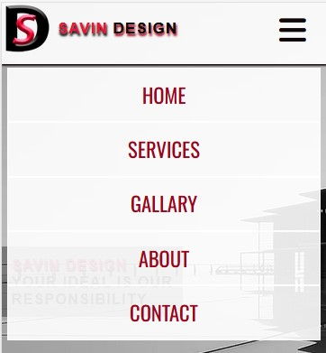
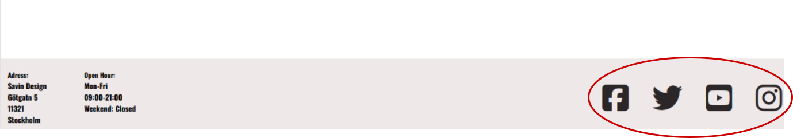

# SAVIN-DESIGN
(Developer: Sanor Smith)

[SAVIN DESIGN Live Page]( https://sanorsmith.github.io/CI_PP1_SD/)

## Table of Content
#
0. [Introduction](#introduction)
1. [Project Goals](#project-goals)
    - [User Goals](#user-goals)
    - [Company Objectives](#company-bjectives)
2. [User Experience(UX)](#user-experienceux)
    - [Intended audience](#ideal-user)
    - [User Requirements and Expectations](#user-requirements-and-expectations)
    - [User Stories](#user-stories)
3. [Design](#design)
    - [ Chosen Design](#chosen-design)
    - [Wireframes](#wireframes)
    - [Colour](#colour)
    - [Fonts](#fonts)
    - [Structure](#structure)
    
4. [Technologies Used](#technologies-used)
    - [Primary Programming Languages Employed](#languages)
    - [Frameworks & Tools](#frameworks-libraries--programs-used)
5. [Features](#features)
     - [Existing-features](#existing-features) 
6. [Testing](#validation)
    - [HTML Validation](#html-validation)
    - [CSS Validation](#css-validation)
    - [Accessibility](#accessibility)
    - [Performance](#performance)
    - [Device testing](#device-testing)
    - [Browser compatibility](#browser-compatability)
    - [Testing user stories](#testing-user-stories)
8. [Bugs](#bugs)
9. [Deployment](#deployment)
   - [Deploying on GitHub pages](#deploying-on-github-pages)
   - [Local Development](#local-development)      
10. [Credits](#credits)
11. [Acknowledgments](#acknowledgments)

## Introduction

SAVIN will be announced in 2024 by Sanor Smith and Sharmen Bilbas, the company will stand out in the field of architecture for its innovative and sustainable designs. The company believes architecture is an art that shapes human experiences, blending beauty with practicality. Its team of skilled architects and designers handles a diverse range of projects, emphasizing ecological responsibility and energy efficiency. SAVIN is recognized for its impressive portfolio and is committed to pushing architectural boundaries with advanced technology and innovative practices, aiming to meet the evolving needs of society.

## Project Goals 
***

### User Goals
- To find an architectural company that provides efficient, safe, and high-quality services.
- Seek a comprehensive overview of the company's offerings.
- Transparent and clear pricing for all services.
- Easily accessible information about the company.
- Clearly displayed location of the architectural firm.
- Conveniently available contact information for the business.
- Multiple options for communication and connection with the company.

### Company Objectives

- Market and promote the architectural services effectively.
- Attract and increase the clientele base with innovative strategies.
- Grow and develop the architectural business.
- Deliver exceptional services tailored to diverse client needs.
- Offer accessible and prompt information about the firm to prospective clients.
- Establish a unique identity and stand out from other architectural competitors.
- Add significant value to clients and the architectural industry.

[Back to top &uarr;](#SAVIN-DESIGN)

User Experience (UX)
### Intended audience

- New clients interested in architectural services.
- Experienced individuals or entities in need of advanced architectural expertise.
- Repeat clients who appreciate the value and service provided by the architectural firm.

### User Requirements and Expectations

- Concise and well-organized content tailored for architectural interests.
- User-friendly and straightforward navigation system.
- Fully functional website with all features operating seamlessly.
- Aesthetically pleasing design that showcases architectural elegance.
- Website accessibility on various devices and screen sizes.
- Straightforward and effortless methods for contacting the architectural firm.

### User Stories

####  New(First-time) User

New(First-time) User
- As a new user, I want to easily navigate the website.
- As a new user, I want to understand the company's offerings.
- As a new user, I want to know the pricing of the company's services.
- As a new user, I want to discover the most efficient way to contact the company.
- As a new user, I want to find information about the company's location.
- As a new user, I want to learn about the company's history and how long it has been in existence.
- As a new user, I want to get a sense of what it's like to use one or more of the services.
- As a new user, I want to see the design of completed projects.

#### Returning User
- As a returning client, I need to easily find information on the architectural firm's website as per my previous experience.
- As a returning client, I desire easy and quick access to contact the company or to navigate back to the homepage.
- As a returning client, I aim to find and connect with the architectural company on social media platforms.
- As a returning client, I am interested in learning more about the architectural team and their qualifications.
- As a returning client, I wish to explore all available service options offered by the architectural firm.
- As a returning client, I desire a seamless website experience that I can confidently recommend to my associates.

[Back to top &uarr;](#SAVIN-DESIGN)

## Design

### Design decisions
This project has been crafted to appeal to a diverse range of clients and potential users, featuring a minimalist white background complemented by striking, high-quality images of architectural designs and structures. This visually engaging and attractive approach aims to capture attention and interest.

### Wireframes

***

- [Mobile-wireframes(pdf)](docs/wireframes/mobile_wireframes.pdf)
- [Tablet-wireframes(pdf)](docs/wireframes/tablet_wireframes.pdf)
- [Desktop-wireframes(pdf)](docs/wireframes/desktop_wireframes.pdf)

### Colour
A minimalist colour palette that gives the website a bright and uncluttered appearance.

### Fonts

Google fonts are used as follows:

- The website primarily employs the Oswald sans-serif font, which is integrated into the CSS file using the @import method. However, to enhance site performance, we opt to download it and link it through @font-face class. This font was selected for its compatibility with web body text, ensuring readability even at small sizes.

- The contact form utilizes the Font Awesome 6, which has been imported into the html through java-script. This font family was chosen for its excellent readability.

### Structure

The website is designed to be intuitive, user-friendly, and familiar, structured as a single landing page segmented into distinct sections. Navigation is tailored separately for mobile and desktop screens, following standard industry practices. The website is divided into six separate sections as follows:

- Main Section: This is the idol section with an engaging image, dual navigation tailored to screen size, a welcoming introduction, and a brief overview of the architectural firm.

- Projects Section: Showcasing three different types of architectural services or projects for clients to explore.

- Portfolio Section: A carousel feature displaying a selection of the firm's past architectural projects.

- Gallery Section: Images that highlight the firm's architectural achievements and project snapshots.

- About Us Section: Detailed information about the architectural company, its history, and philosophy.

- Contact Us Section: Essential contact information, an inquiry form, and an integrated Google Maps feature pinpointing the firm’s location.

## Technologies Used

### Languages
- HTML5
- CSS

### Frameworks Libraries & Programs Used
- GitHub
- Git
-Visual Studio Code
- Squoosh
- Photoshope
- Font Awesome
- Google Fonts
- Balsamiq
- Coolors
- Archicad
- Grammarly

[Back to top &uarr;](#SAVIN-DESIGN)

## Features

 company 

### Existing Features

### Favicon
A small icon or a set of icons associated with a website, web page, or web application, in this instance represented by a custom-designed logo specific to the architectural company.

 

### Logo
Incorporated as a prominent navigation element on the website, this custom design was personally created by me using Photoshop.

### Navigation
- Two distinct navigation types (for mobile and desktop):
- Both navigation systems are user-friendly, intuitive, and adaptable to all screen sizes. They feature a hamburger menu for mobile devices and screens up to 768px, and a sticky navigation bar for screens larger than 768px. This setup, with links to specific sections, offers users a clear and straightforward way to navigate the website. For the desktop version, the links are underlined and increase in size upon hover, enhancing user interaction.
- User story addressed: 0, 7, 8.

### Welcome and Our services section
- These six sections feature with six images accompanied by text that introduces the user to the company and the services offered.
- The arrangement of these images is achieved using CSS Flexbox.

### Gallery
- This section showcases fifteen images of 3D design models and completed projects undertaken by the company, providing users with insights into the company's work.
- The layout of these images is created using CSS Flexbox, ensuring high responsiveness across all devices.

### About us 
- Additional details about the company are complemented by three four divisions, three of them displaying images along with a brief description of their role and experience.
- The layout of these images is created using multiple CSS Flexgrid, ensuring high responsiveness across all devices.

### Contact us
- In this section, users have multiple options to reach out to the company, including a contact form, an embedded Google map showing the company's location, and three information boxes for the address, phone number, and email.
- These elements are neatly displayed using CSS Flexbox.

### Footer
- Comprises three components: the company's logo (which links back to the top of the page), a social media section (with links for connecting with the company), and a trademark section (displaying the developer's name and the year the project was developed).
- These elements are efficiently organized and presented using CSS Flexbox.

## Testing

### HTML Validation
Testing was conducted throughout the development process using Chrome Developer Tools and again upon project completion. The HTML of the website was validated using the W3C Markup Validation Service, and all code successfully passed without any errors.

Index.html

404 page

[Back to top &uarr;](#SAVIN-DESIGN)

### CSS Validation
The CSS code of the website was tested using the W3C Jigsaw CSS Validation Service, which confirmed that the code was error-free.

Css

### Accessibility

We used  WAVE WebAIM web accessibility evaluation service to ensure the project's high standards regarding accessibility.

Index

Gallary

404-page

### Performance
I used Google Lighthouse in Google Chrome Developer Tools to test the performance of the project.

Website-Index-mobile

Website-Gallary-mobile

Website-Index-desktop

Website-Gallary-desktop

404.page-mobile

404.page-desktop

### Device testing
- Lenovo Legion T5AMR5
- Samsung A52, Galaxy 20, Ultra 
- Iphone 5,6,7,12,12pro,14Max-
- Ipad Air,Pro
 
 ### Browser Compatability 
 - Project was developed in the Google Chrome browser and then tested in:
 - Microsoft Edge
 - Mozilla Firefox

 [Back to top &uarr;](#SAVIN-DESIGN)

 ### Testing user stories

 0. As a New User,I want to easily to navigate the entire website intuitively.

| **Feature**                     | **Action**                          | **Expected Result**                                                                  | **Actual Result** |
|---------------------------------|-------------------------------------|--------------------------------------------------------------------------------------|-------------------|
|   Navigation                    | The initial section's navigation bar, or 'hamburger' menu, allows you to access any section of the page.| Users directed to their intended section. | Working as expected|
|   Sticky NAV-Bar                            | The navigation bar remains fixed at the top of the screen, ensuring that users are smoothly directed to their desired page | Jump to desired page| Working as expected|
|   Contact Us Section                     | Above the footer, users can click to initiate contact and submit their messages and details. | Efficiently reach out to the company, submit your message and relevant details." |Working as expected|
|   Footer                              | At the bottom of the website, users can navigate and connect through social networks |offering additional avenues for user interaction and engagement with the company. | Working as expected |

Screenshots

1. As a New User,I want to know what the company offers.

| **Feature**                     | **Action**                          | **Expected Result**                                                                  | **Actual Result** |
|---------------------------------|-------------------------------------|--------------------------------------------------------------------------------------|-------------------|
|Servic Offers| Visit the service section, explore the available options, and take action with a simple click |It's up to the user to decide and contact. |Working as expected|
| Design Images| Click to explore the company's offerings | Users have the option to select their preferred design. |Working as expected|
| Gallery|Navigate to Gallery section| Examine the images more closely and gain a deeper understanding of certain designs through our service descriptions. |Working as expected|

Screenshots

2. As a New User,I review the company's vision and their approach to accomplishing design objectives.

| **Feature**                     | **Action**                          | **Expected Result**                                                                  | **Actual Result** |
|---------------------------------|-------------------------------------|--------------------------------------------------------------------------------------|-------------------|
|Services| Visit the section to discover how we overcome obstacles and the strategies we employ to achieve optimal results | checking the company's objectives. |Working as expected|

Screenshots

3. As a new user, I seek the most efficient and fastest means of reaching out to the company.

| **Feature**                     | **Action**                          | **Expected Result**                                                                  | **Actual Result** |
|---------------------------------|-------------------------------------|--------------------------------------------------------------------------------------|-------------------|
|Contact us section|Click or Scroll to desired section| The user can view available contact options provided by the company, allowing them to make a choice. |Working as expected|

Screenshots

4. As a New User,I would like to find out the company's physical location..

| **Feature**                     | **Action**                          | **Expected Result**                                                                  | **Actual Result** |
|---------------------------------|-------------------------------------|--------------------------------------------------------------------------------------|-------------------|
|Contact us section with google map|User can click to see exact location |see precise location of company on a map,and address in info box below map|Working as expected| 

Screenshots

5. As a New User,Ivisit the section to discover the company overcome obstacles and the strategies we employ to achieve optimal results.

| **Feature**                     | **Action**                          | **Expected Result**                                                                  | **Actual Result** |
|---------------------------------|-------------------------------------|--------------------------------------------------------------------------------------|-------------------|
|About us section|Navigate to About us section|User can read brief info about company|Working as expected|

Screenshots

6. As a returning user,I need the information I'm looking for to be easy to find as I remember. 

| **Feature**                     | **Action**                          | **Expected Result**                                                                  | **Actual Result** |
|---------------------------------|-------------------------------------|--------------------------------------------------------------------------------------|-------------------|
|Navigation|Use navigation for browsing trough website| Users can effortlessly and intuitively find their way to the desired section. |Working as expected| 

Screenshots

7. As a returning user,I I aim to ensure that I can easily contact the company or return to the initial position within just few clicks.. 

| **Feature**                     | **Action**                          | **Expected Result**                                                                  | **Actual Result** |
|---------------------------------|-------------------------------------|--------------------------------------------------------------------------------------|-------------------|
|Navigate Anywhre|Click and go anywhere in the site|User can in every moment be taken to any section in the site (starting position)|Working as expected|

Screenshots

8. As a returning user,I want to find and connect with company on social media.

| **Feature**                     | **Action**                          | **Expected Result**                                                                  | **Actual Result** |
|---------------------------------|-------------------------------------|--------------------------------------------------------------------------------------|-------------------|
|Footer| Go to the footer section and select one of the social media icons. |User is taken to preferred  a social media platform|Working as expected|

Screenshots

9. As a returning user,I want to see all options that are available to me.

| **Feature**                     | **Action**                          | **Expected Result**                                                                  | **Actual Result** |
|---------------------------------|-------------------------------------|--------------------------------------------------------------------------------------|-------------------|
|Services section| Go to the Welcome and Our Services section | Users can reacquaint themselves with the available choices. |Working as expected| 

Screenshots

10. As a returning user, I desire a satisfying website experience, allowing me to confidently recommend it to my friends.
| **Feature**                     | **Action**                          | **Expected Result**                                                                  | **Actual Result** |
|---------------------------------|-------------------------------------|--------------------------------------------------------------------------------------|-------------------|
|Navigation| Explore the entire website. | An easy-to-use and intuitive navigation system for users |Working as expected| 
|Footer|Click and connect| encouragement to engage with at the conclusion of a website |Working as expected| 

Screenshots

Screenshots

[Back to top &uarr;](#SAVIN-DESIGN)

